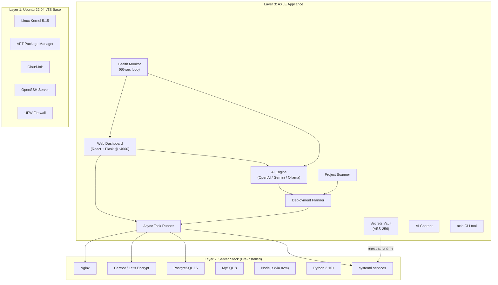
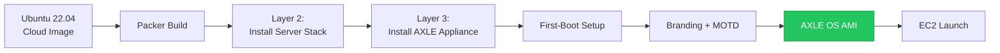
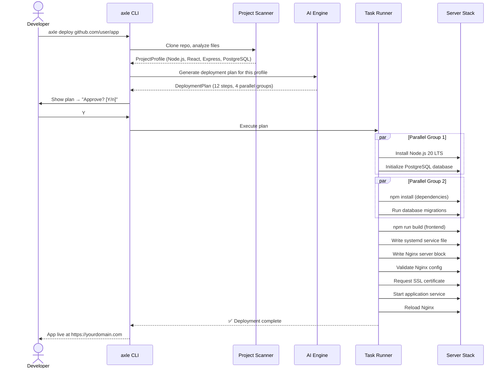

# AXLE OS — AI-Powered Linux Deployment Distribution

## Implementation Plan v2.0

> **Goal**: Build AXLE as a **custom Ubuntu-based Linux distribution** — a purpose-built appliance OS (like Proxmox is for virtualization, TrueNAS is for storage). AXLE OS is for **AI-powered application deployment**. You launch an EC2 instance with the AXLE AMI, and everything — Nginx, the AI engine, the dashboard, the secrets vault, monitoring — is pre-installed and ready from first boot.

---

## 1. What AXLE OS Actually Is

### The Analogy

| Appliance Distro | Base OS | Purpose | Pre-installed |
|------------------|---------|---------|---------------|
| **Proxmox VE** | Debian | Virtualization | KVM, LXC, web UI, cluster tools |
| **TrueNAS SCALE** | Debian | Storage | OpenZFS, SMB/NFS, Kubernetes |
| **Ubuntu Server** | Debian | General purpose | Cloud-init, snap, netplan |
| **AXLE OS** | **Ubuntu 22.04 LTS** | **App Deployment** | **AI engine, Nginx, dashboard, vault, monitor** |

### How It Works (User's Perspective)

```
1. Launch EC2 instance with AXLE OS AMI
2. SSH in → See branded AXLE welcome screen
3. First-boot wizard runs → Configure AI provider, admin password
4. Open browser → https://<ec2-ip>:4000 → AXLE Dashboard
5. Paste GitHub URL → AI detects stack → One-click deploy
6. App is live on port 443 with SSL. Monitoring active. Done.
```

**Zero installation. Zero configuration. Just launch and deploy.**

---

## 2. Architecture — Three Layers

AXLE OS is built in three architectural layers, exactly like Proxmox and TrueNAS:



### Layer 1: Ubuntu 22.04 LTS Base
Standard Ubuntu Server — kernel, apt, systemd, networking, SSH. We don't modify the kernel. We inherit Ubuntu's security patches and LTS support.

### Layer 2: Server Stack (Pre-installed)
Everything a production server needs, already installed and configured:
- **Nginx** — ready to generate server blocks on demand
- **Certbot** — ready to issue SSL certificates
- **PostgreSQL 16** — installed but not initialized (waits for a project that needs it)
- **Node.js** (via nvm) — multiple versions available
- **Python 3.10+** — system Python + pyenv for version management
- **UFW** — firewall pre-configured (22, 80, 443 open)

### Layer 3: AXLE Appliance
The intelligent layer that makes this a "smart OS":
- **AI Engine** — multi-provider (OpenAI, Gemini, Ollama) for deployment planning + diagnosis
- **Project Scanner** — detects stack from project files
- **Deployment Planner** — AI generates ordered execution plan
- **Async Task Runner** — parallel execution with dependency graph
- **Secrets Vault** — AES-256 encrypted, architecturally isolated from AI
- **Health Monitor** — 60-second checks with AI anomaly detection
- **Web Dashboard** — real-time logs, deploy wizard, chatbot (port 4000)
- **`axle` CLI** — command-line interface for everything

---

## 3. Distribution Build Pipeline

### How We Build the AXLE OS Image

We follow the same pattern as Proxmox/TrueNAS — automated build pipeline that produces a deployable image:



| Tool | Purpose |
|------|---------|
| **HashiCorp Packer** | Automated AMI builder — spins up temp EC2, runs scripts, snapshots |
| **Shell provisioners** | Install all packages, configure services, apply branding |
| **Cloud-init** | First-boot initialization (network, SSH keys, timezone) |
| **Custom first-boot service** | AXLE setup wizard (AI provider, admin password) |
| **live-build** *(future)* | For producing downloadable ISO images (bare metal installs) |

### Build Outputs

| Format | Use Case | Tool |
|--------|----------|------|
| **AWS AMI** | Primary — launch on EC2 directly | Packer |
| **OVA/VMDK** | DigitalOcean, Hetzner, local VMs | Packer + post-processor |
| **ISO** *(Phase 3)* | Bare metal installs, custom hosting | live-build |
| **Docker image** *(dev only)* | Local development/testing of AXLE itself | Dockerfile |

---

## 4. Project Structure

```
axle/
├── README.md
├── LICENSE
│
├── build/                              # === Distribution Build Pipeline ===
│   ├── packer/
│   │   ├── axle-ami.pkr.hcl           # Packer template for AWS AMI
│   │   ├── variables.pkr.hcl          # Build variables (region, instance type)
│   │   └── scripts/
│   │       ├── 01-base-setup.sh        # Update Ubuntu, install base deps
│   │       ├── 02-server-stack.sh      # Install Nginx, PostgreSQL, Node.js, etc.
│   │       ├── 03-install-axle.sh      # Install AXLE Python package + dashboard
│   │       ├── 04-branding.sh          # MOTD, os-release, SSH banner
│   │       ├── 05-first-boot.sh        # Configure first-boot wizard service
│   │       └── 06-cleanup.sh           # Remove build artifacts, minimize image
│   │
│   ├── cloud-init/
│   │   ├── user-data.yaml             # Default cloud-init config
│   │   └── axle-cloud-init.cfg        # AXLE-specific cloud-init module
│   │
│   ├── branding/
│   │   ├── motd/                       # Dynamic MOTD scripts
│   │   │   ├── 00-axle-banner          # ASCII art logo + version
│   │   │   ├── 10-system-info          # CPU, RAM, disk status
│   │   │   ├── 20-deployment-status    # Currently deployed app info
│   │   │   └── 90-help                 # Quick command reference
│   │   ├── os-release                  # AXLE OS identity file
│   │   ├── issue                       # Pre-login banner
│   │   └── ssh-banner                  # SSH connection banner
│   │
│   └── firstboot/
│       ├── axle-firstboot.service      # systemd unit for first-boot wizard
│       └── axle-firstboot.py           # Interactive setup wizard (TUI)
│
├── axle/                               # === Core Python Package ===
│   ├── __init__.py
│   ├── __main__.py                     # CLI entry point
│   ├── cli.py                          # CLI commands: axle deploy, axle status, etc.
│   │
│   ├── core/
│   │   ├── __init__.py
│   │   ├── scanner.py                  # Project stack detection
│   │   ├── planner.py                  # AI deployment plan builder
│   │   ├── runner.py                   # Async parallel task executor
│   │   └── models.py                   # Pydantic models (ProjectProfile, DeploymentPlan)
│   │
│   ├── ai/
│   │   ├── __init__.py
│   │   ├── engine.py                   # Multi-provider AI router
│   │   ├── providers/
│   │   │   ├── __init__.py
│   │   │   ├── openai_provider.py
│   │   │   ├── gemini_provider.py
│   │   │   └── ollama_provider.py
│   │   └── prompts.py                  # System prompts for planning + diagnosis
│   │
│   ├── plugins/                        # Server configuration plugins
│   │   ├── __init__.py
│   │   ├── base.py                     # Base plugin interface
│   │   ├── nginx.py                    # Nginx config writer + validator
│   │   ├── ssl.py                      # Certbot automation
│   │   ├── database.py                 # PostgreSQL/MySQL setup + migrations
│   │   ├── systemd.py                  # Service management
│   │   ├── runtime.py                  # Node/Python/Go/Java installer
│   │   └── firewall.py                 # UFW rules
│   │
│   ├── secrets/
│   │   ├── __init__.py
│   │   └── vault.py                    # AES-256 encrypted env store
│   │
│   ├── monitor/
│   │   ├── __init__.py
│   │   ├── health.py                   # 60-second health check loop
│   │   ├── metrics.py                  # CPU, RAM, disk, HTTP collectors
│   │   └── autofix.py                  # AI-driven anomaly resolution
│   │
│   └── config/
│       ├── __init__.py
│       └── settings.py                 # Pydantic settings (reads /etc/axle/axle.conf)
│
├── web/                                # === Web Dashboard ===
│   ├── api/                            # Flask backend
│   │   ├── __init__.py
│   │   ├── app.py                      # Flask app factory
│   │   ├── routes/
│   │   │   ├── deploy.py               # Deployment endpoints
│   │   │   ├── projects.py             # Project management
│   │   │   ├── secrets.py              # Secrets vault API
│   │   │   ├── monitor.py              # Metrics endpoints
│   │   │   └── chatbot.py              # AI chatbot WebSocket
│   │   └── websocket.py               # Socket.IO handlers
│   │
│   └── dashboard/                      # React frontend (Vite)
│       ├── package.json
│       ├── vite.config.js
│       ├── index.html
│       └── src/
│           ├── App.jsx
│           ├── index.css               # Design system (dark theme)
│           ├── components/
│           │   ├── DeployWizard/        # GitHub URL → detect → plan → deploy
│           │   ├── LogViewer/           # Real-time terminal log stream
│           │   ├── Dashboard/           # System overview + metrics
│           │   ├── SecretsVault/        # Env variable manager
│           │   ├── Chatbot/             # AI assistant panel
│           │   └── Rollback/            # Deployment history + rollback
│           ├── hooks/
│           └── utils/
│
├── templates/                          # Jinja2 templates for server configs
│   ├── nginx/
│   │   ├── reverse_proxy.conf.j2
│   │   ├── static_site.conf.j2
│   │   └── fullstack.conf.j2
│   ├── systemd/
│   │   └── app.service.j2
│   └── database/
│       ├── postgres_init.sql.j2
│       └── mysql_init.sql.j2
│
├── tests/
│   ├── test_scanner.py
│   ├── test_planner.py
│   ├── test_plugins/
│   └── test_api/
│
├── docs/
│   ├── getting-started.md
│   ├── architecture.md
│   └── building-the-image.md
│
├── pyproject.toml                      # Python package config
├── .env.example                        # AI provider key template
└── Makefile                            # Build shortcuts: make ami, make test
```

---

## 5. Key Features — What's Baked Into AXLE OS

### 5.1 The First-Boot Experience

When you launch an AXLE OS instance for the first time and SSH in:

```
╔══════════════════════════════════════════════════════════════╗
║                                                              ║
║       █████╗ ██╗  ██╗██╗     ███████╗     ██████╗ ███████╗  ║
║      ██╔══██╗╚██╗██╔╝██║     ██╔════╝    ██╔═══██╗██╔════╝  ║
║      ███████║ ╚███╔╝ ██║     █████╗      ██║   ██║███████╗  ║
║      ██╔══██║ ██╔██╗ ██║     ██╔══╝      ██║   ██║╚════██║  ║
║      ██║  ██║██╔╝ ██╗███████╗███████╗    ╚██████╔╝███████║  ║
║      ╚═╝  ╚═╝╚═╝  ╚═╝╚══════╝╚══════╝     ╚═════╝ ╚══════╝  ║
║                                                              ║
║      AI-Powered Linux Deployment Engine — v1.0               ║
║                                                              ║
╠══════════════════════════════════════════════════════════════╣
║  System: Ubuntu 22.04 LTS | 4 vCPU | 8 GB RAM | 50 GB SSD  ║
║  Status: First boot — setup required                         ║
║                                                              ║
║  Run: axle setup                                             ║
╚══════════════════════════════════════════════════════════════╝
```

The `axle setup` command launches a TUI (Terminal UI) wizard:

1. **AI Provider** → Choose OpenAI / Gemini / Ollama, enter API key
2. **Admin Password** → Set password for the web dashboard
3. **Domain** *(optional)* → Enter domain name for SSL
4. **Dashboard** → Start the dashboard service → opens on `:4000`

After setup, the MOTD changes to show live system status on every SSH login:

```
  AXLE OS v1.0 | Ubuntu 22.04 LTS
  ─────────────────────────────────
  CPU: 12% | RAM: 2.1/8 GB | Disk: 14/50 GB
  Deployed: my-saas-app (Node.js + PostgreSQL)
  Status: ● Running | Uptime: 14d 3h
  SSL: Valid until 2026-09-15
  Dashboard: http://10.0.1.42:4000
  ─────────────────────────────────
  axle status    — View deployment details
  axle deploy    — Deploy a new application
  axle logs      — View application logs
  axle chat      — Ask AI about your server
```

### 5.2 The `axle` CLI (Available System-Wide)

```bash
# Core commands
axle setup                    # First-boot wizard
axle deploy <github-url>      # Deploy from GitHub URL
axle deploy --zip <file>      # Deploy from ZIP
axle status                   # Show current deployment
axle logs                     # Stream application logs
axle logs --tail 100          # Last 100 lines

# AI commands
axle chat "why is my app slow?"       # Ask AI about your server
axle plan <github-url>                # Preview deployment plan (dry run)
axle diagnose                         # AI scans for issues

# Server management
axle secrets list              # List env variable keys
axle secrets set KEY=value     # Add/update a secret
axle secrets delete KEY        # Remove a secret
axle rollback                  # Revert to previous deployment
axle rollback --list           # List available snapshots

# System
axle update                    # Update AXLE OS components
axle info                      # Show system info + version
axle dashboard start|stop      # Control the web dashboard
```

### 5.3 AI-Powered Deployment (Core Feature)

The full flow when a user runs `axle deploy https://github.com/user/app`:



### 5.4 Pre-Installed Server Stack

Everything is installed during image build, ready to be activated:

| Component | Version | State on Boot | Activated When |
|-----------|---------|---------------|----------------|
| **Nginx** | Latest stable | Installed, running (default page) | Deployment configures server blocks |
| **Certbot** | Latest | Installed | SSL requested during deploy |
| **PostgreSQL 16** | 16.x | Installed, not initialized | Project needs PostgreSQL |
| **MySQL 8** | 8.x | Installed, not initialized | Project needs MySQL |
| **Node.js** | 18, 20, 22 (via nvm) | Installed | Project uses Node.js |
| **Python** | 3.10, 3.11, 3.12 (via pyenv) | Installed | Project uses Python |
| **Go** | Latest stable | Installed | Project uses Go |
| **Git** | Latest | Installed, ready | Always |
| **UFW** | Default | Active (22, 80, 443 open) | Always |

### 5.5 Secrets Vault (AI-Isolated)

> [!CAUTION]
> The vault is **architecturally isolated** from the AI engine. The AI sees only key names, never values. This is a hard security invariant baked into the OS.

- Stored at `/var/lib/axle/vault.enc`
- AES-256 encryption at rest
- Master key derived from admin password via PBKDF2
- Values injected into systemd `EnvironmentFile` at deploy/restart time only
- Never appear in logs, dashboard, or AI context

### 5.6 Health Monitor (Always Running)

A systemd service (`axle-monitor.service`) that runs continuously:
- **Every 60 seconds**: Check process status, HTTP health, CPU/RAM/disk, DB connections, SSL expiry
- **On anomaly**: Feed context to AI → get diagnosis + auto-fix or recommendation
- **Auto-actions**: Restart crashed processes, renew expiring SSL, clear disk space
- **Dashboard**: All metrics displayed in real-time on the web UI

### 5.7 Web Dashboard (Port 4000)

Pre-installed React app served by Flask, accessible at `http://<ip>:4000`:

- **Deploy Wizard** — Paste URL → review AI plan → one-click deploy
- **Live Log Viewer** — Real-time terminal output with ANSI colors
- **System Metrics** — CPU, RAM, disk, network graphs
- **Secrets Manager** — CRUD for env variables (values masked)
- **Deployment History** — All past deploys with one-click rollback
- **AI Chatbot** — Ask natural language questions about your server
- **Protected** — Login required (admin password set during first-boot)

### 5.8 Custom Branding

| Element | Customization |
|---------|---------------|
| `/etc/os-release` | `PRETTY_NAME="AXLE OS 1.0 (Based on Ubuntu 22.04 LTS)"` |
| `/etc/issue` | Pre-login banner with AXLE logo |
| `/etc/update-motd.d/` | Dynamic MOTD — system stats, deployment status, help |
| SSH banner | AXLE branding on SSH connection |
| Nginx default page | AXLE welcome page (before first deploy) |

---

## 6. Phased Roadmap

### Phase 1 — Core OS (v1.0) 🎯 *Build This First*

| # | Component | Description |
|---|-----------|-------------|
| 1 | **Packer build pipeline** | Automated AMI builder with all provisioning scripts |
| 2 | **Layer 2: Server stack install** | Nginx, Certbot, PostgreSQL, MySQL, Node.js, Python, Go |
| 3 | **Branding** | MOTD, os-release, SSH banner, Nginx default page |
| 4 | **First-boot wizard** | `axle setup` TUI — AI provider, admin password, domain |
| 5 | **Project Scanner** | Detect stack from repo files (package.json, requirements.txt, etc.) |
| 6 | **AI Engine** | Multi-provider abstraction (OpenAI, Gemini, Ollama) |
| 7 | **Deployment Planner** | AI generates ordered, parallelizable deployment plan |
| 8 | **Server Plugins** | Nginx, SSL, Database, systemd, Runtime, Firewall |
| 9 | **Async Task Runner** | Execute plan with parallel groups, real-time log streaming |
| 10 | **Secrets Vault** | AES-256 encrypted env store |
| 11 | **`axle` CLI** | `deploy`, `status`, `logs`, `secrets`, `setup` commands |
| 12 | **Web Dashboard** | Deploy wizard, log viewer, secrets manager |
| 13 | **Systemd services** | `axle-dashboard.service`, `axle-api.service` |

### Phase 2 — Monitor (v1.5) 🔍

| # | Component | Description |
|---|-----------|-------------|
| 14 | **Health Monitor** | 60-second polling service (`axle-monitor.service`) |
| 15 | **AI Anomaly Detection** | Auto-diagnosis + fix recommendations |
| 16 | **Deployment Rollback** | Snapshot system + one-click revert |
| 17 | **AI Chatbot** | Natural language server queries in dashboard |
| 18 | **`axle update`** | Self-update mechanism (pull latest AXLE packages) |

### Phase 3 — Scale (v2.0) 🚀

| # | Component | Description |
|---|-----------|-------------|
| 19 | **MongoDB + Redis** | Additional database support |
| 20 | **CI/CD webhooks** | GitHub push → auto-deploy |
| 21 | **ISO image** | Downloadable ISO for bare metal (live-build) |
| 22 | **Multi-cloud** | DigitalOcean, Hetzner, Linode image builds |
| 23 | **Blue-green deploys** | Zero-downtime deployment strategy |

### Phase 4 — Enterprise (v3.0) 🏢

| # | Component | Description |
|---|-----------|-------------|
| 24 | **RBAC** | Team access controls |
| 25 | **Audit logging** | Full action audit trail |
| 26 | **Multi-domain** | Multiple apps on one AXLE instance |
| 27 | **Alerts** | Slack / email / webhook notifications |
| 28 | **AXLE Marketplace** | One-click app templates (WordPress, Ghost, etc.) |

---

## 7. Build Strategy — Sprint Plan

### Sprint 1: Foundation & Build Pipeline (Week 1-2)
- Set up the Python package structure (`axle/`)
- Create Packer template + provisioning scripts
- Build first AXLE AMI with server stack pre-installed
- Implement branding (MOTD, os-release, banners)
- Test: Launch AMI on EC2, verify everything is installed

### Sprint 2: Core Engine (Week 3-4)
- Project Scanner — detect stack from files
- AI Engine — multi-provider abstraction
- Deployment Planner — AI generates plans
- Pydantic models for all data structures

### Sprint 3: Server Plugins (Week 5-6)
- Nginx plugin (config generation + validation)
- SSL plugin (Certbot automation)
- Database plugin (PostgreSQL + MySQL init + migrations)
- systemd plugin (service files + management)
- Runtime plugin (Node.js/Python/Go install + deps + build)

### Sprint 4: Execution + CLI (Week 7-8)
- Async Task Runner (parallel execution, log streaming)
- Secrets Vault (encryption, injection)
- `axle` CLI (deploy, status, logs, secrets, setup)
- First-boot wizard (TUI)

### Sprint 5: Dashboard (Week 9-11)
- Flask API + Socket.IO
- React dashboard (deploy wizard, log viewer, secrets, history)
- systemd services for dashboard + API

### Sprint 6: Polish + Ship (Week 12)
- End-to-end testing (deploy real apps)
- Error handling, rollback on failure
- Documentation
- Publish AMI to AWS Marketplace

---

## 8. User Review Required

> [!IMPORTANT]
> ### Decisions that need your input:
>
> 1. **Primary AI Provider**: Which should be the default? 
>    - **OpenAI** (GPT-4) — best quality, requires API key ($)
>    - **Gemini** — good quality, requires API key ($)
>    - **Ollama** — free, runs locally, but needs GPU/RAM on the EC2 instance
>    - *Recommendation*: Support all three, default to Ollama (free) with option to upgrade
>
> 2. **AWS-Only or Multi-Cloud from Start?**
>    - The Packer template can output multiple formats. Should we plan for DigitalOcean/Hetzner from Phase 1, or keep AWS-only for v1.0?
>    - *Recommendation*: AWS AMI only for v1.0, architect code to be cloud-agnostic
>
> 3. **Phase 1 Scope**: Agree to build everything above in Phase 1 before starting monitoring/chatbot features?
>
> 4. **Dashboard Auth**: Simple password auth (set during first-boot) is enough for v1.0, or do you want full user/session auth from the start?
>
> 5. **Docker Support**: The whitepaper focuses on native systemd. Should AXLE also offer Docker as an alternative deployment mode, or stay purely native?

---

## 9. Verification Plan

### Automated Tests
- `pytest` for scanner, planner, plugins (mock file system + subprocess)
- `pytest-asyncio` for async task runner
- Packer `validate` for AMI template
- CI/CD pipeline to build + test AMI automatically

### Integration Test
Deploy these real-world stacks on a fresh AXLE OS instance:
1. **React + Express + PostgreSQL** (classic full-stack)
2. **Next.js** (SSR app)
3. **Django + PostgreSQL** (Python stack)
4. **FastAPI** (Python API)
5. **Static HTML site** (simplest case)

### Manual Verification
- Launch fresh AMI → verify first-boot wizard works
- Deploy a real app → verify it's live on HTTPS
- Check MOTD shows correct system + deployment status
- Verify secrets never appear in any logs
- Test dashboard from external browser

---

## 10. Open Questions

> [!WARNING]
> ### Technical decisions to finalize:
>
> 1. **AXLE's own database**: It needs to store deployment history, project configs. Options: SQLite (simplest) or PostgreSQL (already installed). *Recommendation*: SQLite at `/var/lib/axle/axle.db`
>
> 2. **Update mechanism**: How should `axle update` work? Options:
>    - Custom APT repository (most professional, like Proxmox)
>    - pip install from PyPI  
>    - git pull + rebuild
>    - *Recommendation*: Custom APT repo for the full Proxmox experience, but start with pip for v1.0
>
> 3. **Name confirmed?**: AXLE OS — is this the final name for the distribution?
