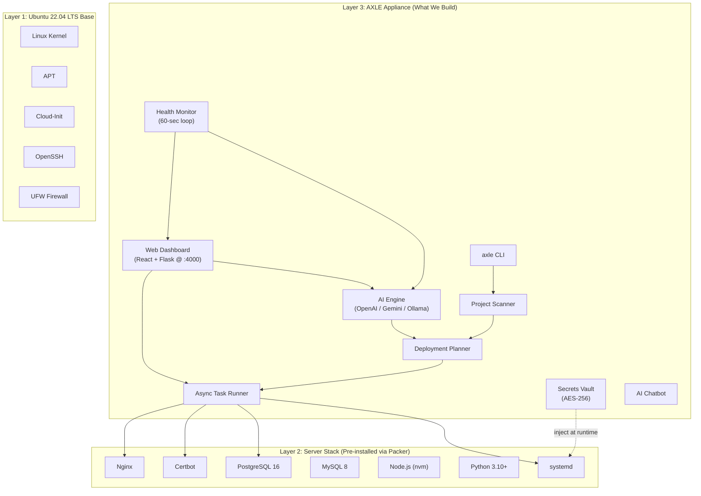
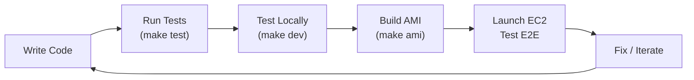
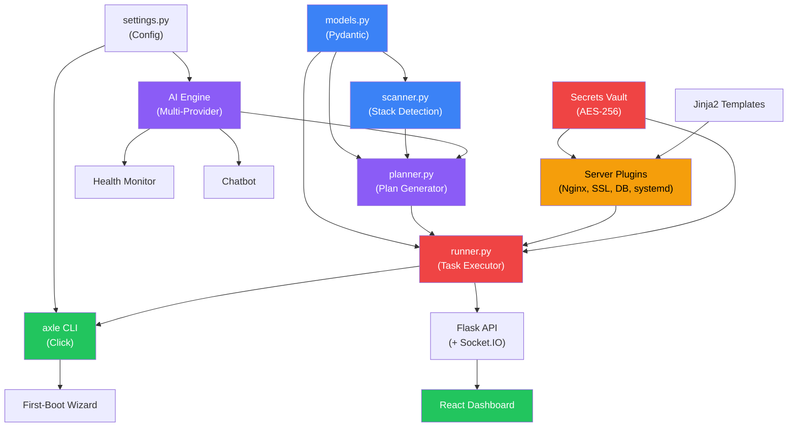

# 🚀 AXLE OS — Complete Project Blueprint

## What Are We Building?

**AXLE OS** = A **custom Ubuntu-based Linux distribution** purpose-built for AI-powered application deployment. Think Proxmox (for virtualization) but for **deploying full-stack apps to EC2**.

```
Developer → Launches AXLE AMI on EC2 → SSHs in → Pastes GitHub URL → AI deploys everything → App is live on HTTPS
```

**Zero manual config. No Ansible. No Docker. No vendor lock-in.**

---

## Architecture Overview



---

## 🎯 Technical Decisions (Resolved)

Before we start coding, here are the key decisions I recommend based on the whitepaper and implementation plan:

| # | Decision | Recommendation | Rationale |
|---|----------|---------------|-----------|
| 1 | **Primary AI Provider** | Support all 3 (OpenAI, Gemini, Ollama), default to **Gemini** | Good quality, free tier, no local GPU needed |
| 2 | **Cloud Target** | **AWS-only for v1.0**, architecture cloud-agnostic | Focus on one platform, expand later |
| 3 | **Phase 1 Scope** | Full core (13 components) before monitoring/chatbot | Ship a usable product first |
| 4 | **Dashboard Auth** | **Simple password auth** (set during first-boot) | Sufficient for single-user v1.0 |
| 5 | **Docker Support** | **No** — pure native systemd for v1.0 | Simpler, aligns with whitepaper philosophy |
| 6 | **AXLE Internal DB** | **SQLite** at `/var/lib/axle/axle.db` | Zero config, already installed on Ubuntu |
| 7 | **Update Mechanism** | **pip install** for v1.0, custom APT repo later | Ship fast, professionalize later |
| 8 | **Name** | **AXLE OS** | Confirmed from whitepaper |

> [!IMPORTANT]
> **Please confirm or change any of these decisions before we start coding.** These affect the entire architecture.

---

## 📁 Project Structure

```
axle/
├── README.md
├── LICENSE (MIT)
├── pyproject.toml                      # Python package config (setuptools)
├── Makefile                            # Build shortcuts: make ami, make test, make dev
├── .env.example                        # AI provider key template
├── .gitignore
│
├── build/                              # === Distribution Build Pipeline ===
│   ├── packer/
│   │   ├── axle-ami.pkr.hcl           # Packer template for AWS AMI
│   │   ├── variables.pkr.hcl
│   │   └── scripts/
│   │       ├── 01-base-setup.sh        # Update Ubuntu, install base deps
│   │       ├── 02-server-stack.sh      # Install Nginx, PostgreSQL, Node.js, etc.
│   │       ├── 03-install-axle.sh      # Install AXLE Python package + dashboard
│   │       ├── 04-branding.sh          # MOTD, os-release, SSH banner
│   │       ├── 05-first-boot.sh        # Configure first-boot wizard service
│   │       └── 06-cleanup.sh           # Remove build artifacts, minimize image
│   │
│   ├── cloud-init/
│   │   ├── user-data.yaml
│   │   └── axle-cloud-init.cfg
│   │
│   ├── branding/
│   │   ├── motd/
│   │   │   ├── 00-axle-banner
│   │   │   ├── 10-system-info
│   │   │   ├── 20-deployment-status
│   │   │   └── 90-help
│   │   ├── os-release
│   │   ├── issue
│   │   └── ssh-banner
│   │
│   └── firstboot/
│       ├── axle-firstboot.service
│       └── axle-firstboot.py
│
├── axle/                               # === Core Python Package ===
│   ├── __init__.py
│   ├── __main__.py
│   ├── cli.py                          # Click-based CLI
│   │
│   ├── core/
│   │   ├── __init__.py
│   │   ├── scanner.py                  # Project stack detection
│   │   ├── planner.py                  # AI deployment plan builder
│   │   ├── runner.py                   # Async parallel task executor
│   │   └── models.py                   # Pydantic models
│   │
│   ├── ai/
│   │   ├── __init__.py
│   │   ├── engine.py                   # Multi-provider AI router
│   │   ├── providers/
│   │   │   ├── __init__.py
│   │   │   ├── openai_provider.py
│   │   │   ├── gemini_provider.py
│   │   │   └── ollama_provider.py
│   │   └── prompts.py                  # System prompts
│   │
│   ├── plugins/
│   │   ├── __init__.py
│   │   ├── base.py                     # Abstract base plugin
│   │   ├── nginx.py
│   │   ├── ssl.py
│   │   ├── database.py
│   │   ├── systemd.py
│   │   ├── runtime.py
│   │   └── firewall.py
│   │
│   ├── secrets/
│   │   ├── __init__.py
│   │   └── vault.py                    # AES-256 encrypted env store
│   │
│   ├── monitor/
│   │   ├── __init__.py
│   │   ├── health.py
│   │   ├── metrics.py
│   │   └── autofix.py
│   │
│   └── config/
│       ├── __init__.py
│       └── settings.py                 # Pydantic settings
│
├── web/                                # === Web Dashboard ===
│   ├── api/                            # Flask backend
│   │   ├── __init__.py
│   │   ├── app.py
│   │   ├── auth.py                     # Password-based auth
│   │   ├── routes/
│   │   │   ├── __init__.py
│   │   │   ├── deploy.py
│   │   │   ├── projects.py
│   │   │   ├── secrets.py
│   │   │   ├── monitor.py
│   │   │   └── chatbot.py
│   │   └── websocket.py
│   │
│   └── dashboard/                      # React frontend (Vite)
│       ├── package.json
│       ├── vite.config.js
│       ├── index.html
│       └── src/
│           ├── App.jsx
│           ├── index.css
│           ├── components/
│           │   ├── DeployWizard/
│           │   ├── LogViewer/
│           │   ├── Dashboard/
│           │   ├── SecretsVault/
│           │   ├── Chatbot/
│           │   └── Rollback/
│           ├── hooks/
│           └── utils/
│
├── templates/                          # Jinja2 server config templates
│   ├── nginx/
│   │   ├── reverse_proxy.conf.j2
│   │   ├── static_site.conf.j2
│   │   └── fullstack.conf.j2
│   ├── systemd/
│   │   └── app.service.j2
│   └── database/
│       ├── postgres_init.sql.j2
│       └── mysql_init.sql.j2
│
├── tests/
│   ├── conftest.py
│   ├── test_scanner.py
│   ├── test_planner.py
│   ├── test_plugins/
│   └── test_api/
│
└── docs/
    ├── getting-started.md
    ├── architecture.md
    └── building-the-image.md
```

---

## 🛠️ Technology Stack

| Component | Technology | Version | Why |
|-----------|-----------|---------|-----|
| **Language** | Python | 3.10+ | Runs on all platforms, great for SSH/system automation |
| **CLI Framework** | Click | 8.x | Clean, composable CLI commands |
| **Data Models** | Pydantic | 2.x | Validation, serialization, settings management |
| **AI (OpenAI)** | openai SDK | 1.x | Official OpenAI Python client |
| **AI (Gemini)** | google-generativeai | latest | Official Google AI client |
| **AI (Ollama)** | ollama SDK | latest | Local model inference |
| **SSH** | paramiko | 3.x | Cross-platform SSH (critical for Windows support) |
| **Encryption** | cryptography | latest | AES-256 for secrets vault |
| **Web Backend** | Flask + Flask-SocketIO | 3.x | Lightweight, real-time logs via WebSocket |
| **Web Frontend** | React + Vite | 18 / 5.x | Fast, modern dashboard |
| **Template Engine** | Jinja2 | 3.x | Nginx/systemd config generation |
| **Database** | SQLite (via SQLAlchemy) | 3.x | AXLE's own internal storage |
| **Process Runner** | asyncio + subprocess | stdlib | Parallel task execution |
| **AMI Builder** | HashiCorp Packer | latest | Automated image building |
| **Testing** | pytest + pytest-asyncio | latest | Unit + async tests |
| **TUI (first-boot)** | Rich / Textual | latest | Beautiful terminal UI |
| **System Tray** | pystray | latest | Cross-platform tray icon |

---

## 📅 Sprint Plan — Phase 1 (v1.0)

### Sprint 1: Foundation & Scaffolding (Week 1-2)

**Goal**: Set up the entire project structure, build pipeline, and branding.

| Task | Description | Priority |
|------|------------|----------|
| Initialize Python package | `pyproject.toml`, `__init__.py`, all module stubs | 🔴 Critical |
| Create Packer template | `axle-ami.pkr.hcl` + provisioning scripts | 🔴 Critical |
| Create branding assets | MOTD scripts, os-release, SSH banner, issue file | 🟡 High |
| First-boot wizard | TUI wizard for AI provider + admin password | 🟡 High |
| Makefile | Build shortcuts (make ami, make test, make dev) | 🟢 Medium |
| `.env.example` + `.gitignore` | Template files | 🟢 Medium |
| **Deliverable**: Launchable AMI with pre-installed server stack + branding |||

### Sprint 2: Core Engine (Week 3-4)

**Goal**: Build the brain — scanning, AI engine, and planning.

| Task | Description | Priority |
|------|------------|----------|
| `models.py` | Pydantic models: `ProjectProfile`, `DeploymentPlan`, `DeploymentStep` | 🔴 Critical |
| `scanner.py` | Detect stack from repo files (package.json, requirements.txt, etc.) | 🔴 Critical |
| `engine.py` | Multi-provider AI abstraction (router pattern) | 🔴 Critical |
| AI Providers | OpenAI, Gemini, Ollama provider implementations | 🔴 Critical |
| `prompts.py` | System prompts for deployment planning + diagnosis | 🟡 High |
| `planner.py` | Generate deployment plans using AI + scanner output | 🟡 High |
| `settings.py` | Pydantic settings (reads from `/etc/axle/axle.conf`) | 🟡 High |
| **Deliverable**: Can scan a repo and produce an AI-generated deployment plan |||

### Sprint 3: Server Plugins (Week 5-6)

**Goal**: Build every configuration plugin that touches the server.

| Task | Description | Priority |
|------|------------|----------|
| `base.py` | Abstract plugin interface with lifecycle hooks | 🔴 Critical |
| `nginx.py` | Generate + validate Nginx configs from Jinja2 templates | 🔴 Critical |
| `ssl.py` | Certbot certificate request + auto-renewal | 🔴 Critical |
| `database.py` | PostgreSQL/MySQL init, create user/db, run migrations | 🔴 Critical |
| `systemd.py` | Generate service files, enable, start, status check | 🔴 Critical |
| `runtime.py` | Install Node/Python/Go, run `npm install`, `pip install`, build | 🟡 High |
| `firewall.py` | UFW rule management | 🟢 Medium |
| Jinja2 templates | `nginx/*.j2`, `systemd/*.j2`, `database/*.j2` | 🔴 Critical |
| **Deliverable**: Every server configuration task is automatable via plugins |||

### Sprint 4: Execution + CLI + Vault (Week 7-8)

**Goal**: Wire everything together — execute plans, manage secrets, expose CLI.

| Task | Description | Priority |
|------|------------|----------|
| `runner.py` | Async parallel task executor with dependency graph | 🔴 Critical |
| `vault.py` | AES-256 encrypted env store, PBKDF2 key derivation | 🔴 Critical |
| `cli.py` | Click CLI: `deploy`, `status`, `logs`, `secrets`, `setup`, `plan` | 🔴 Critical |
| `__main__.py` | Entry point (`python -m axle` / `axle` command) | 🟡 High |
| Real-time log streaming | Stream subprocess output to stdout + WebSocket | 🟡 High |
| **Deliverable**: Full `axle deploy <url>` working end-to-end from CLI |||

### Sprint 5: Web Dashboard (Week 9-11)

**Goal**: Build the browser-based dashboard for deploy, logs, secrets, and history.

| Task | Description | Priority |
|------|------------|----------|
| Flask API (`app.py`) | App factory, CORS, Socket.IO init | 🔴 Critical |
| `auth.py` | Password-based login (bcrypt hash, session-based) | 🔴 Critical |
| API routes | `/deploy`, `/projects`, `/secrets`, `/monitor` | 🔴 Critical |
| WebSocket handlers | Real-time log streaming via Socket.IO | 🔴 Critical |
| React setup | Vite + React 18 project, design system, dark theme | 🔴 Critical |
| Deploy Wizard component | URL input → scan → plan review → deploy → live logs | 🔴 Critical |
| Log Viewer component | Terminal-style real-time log display (ANSI colors) | 🟡 High |
| System Dashboard component | CPU, RAM, disk metrics (charts) | 🟡 High |
| Secrets Vault component | CRUD for env variables (values masked) | 🟡 High |
| Deployment History component | List past deploys + rollback action | 🟢 Medium |
| systemd service files | `axle-dashboard.service`, `axle-api.service` | 🟡 High |
| **Deliverable**: Fully functional web dashboard at `:4000` |||

### Sprint 6: Polish & Ship (Week 12)

**Goal**: End-to-end testing, error handling, documentation, publish.

| Task | Description | Priority |
|------|------------|----------|
| E2E testing | Deploy real apps: React+Express+PG, Django, FastAPI, Next.js, static | 🔴 Critical |
| Error handling | Graceful failures, rollback on deploy error, retry logic | 🔴 Critical |
| Unit tests | Scanner, planner, plugins, API routes | 🟡 High |
| Documentation | getting-started.md, architecture.md, building-the-image.md | 🟡 High |
| README.md | Professional README with badges, screenshots, quick start | 🟡 High |
| AMI publish | Build final AMI, test cold launch | 🟡 High |
| **Deliverable**: Production-ready AXLE OS v1.0 |||

---

## 🖥️ Development Environment Setup

### Prerequisites

| Tool | How to Install | Purpose |
|------|---------------|---------|
| **Python 3.10+** | `brew install python@3.12` | Core language |
| **Node.js 20+** | `brew install node@20` or `nvm install 20` | Dashboard frontend |
| **Packer** | `brew install packer` | AMI building |
| **AWS CLI** | `brew install awscli` | AWS operations |
| **Git** | Already installed | Version control |

### Initial Setup Steps

```bash
# 1. Navigate to project directory
cd "/Applications/My Mac/Development/Projects/Linux Framework/AXLE"

# 2. Initialize Python virtual environment
python3 -m venv .venv
source .venv/bin/activate

# 3. Install development dependencies (after we create pyproject.toml)
pip install -e ".[dev]"

# 4. Set up the React dashboard (after we scaffold it)
cd web/dashboard
npm install
cd ../..

# 5. Copy and configure environment
cp .env.example .env
# Edit .env → add your AI provider API keys

# 6. Run tests
make test

# 7. Start development mode (Flask API + React dev server)
make dev
```

### Development Workflow



---

## 🔗 Component Dependency Graph

This shows what must be built first — the build order:



**Legend**: 🔵 Sprint 2 → 🟣 Sprint 2-3 → 🟠 Sprint 3 → 🔴 Sprint 4 → 🟢 Sprint 4-5

---

## 🚦 How We Build This — Step by Step

### Immediate Next Steps (Today)

1. **Scaffold the entire project** — Create all directories and stub files
2. **Set up `pyproject.toml`** — Define the Python package with all dependencies
3. **Create `.gitignore`** and `.env.example`
4. **Create `Makefile`** — Build shortcuts
5. **Start Sprint 1** — Begin with the foundation

### What I'll Build First (Sprint 1 Focus)

```
1. pyproject.toml          → Python package definition
2. All __init__.py files   → Module structure
3. models.py               → Data models (the backbone)
4. settings.py             → Configuration management
5. Packer template         → AMI build pipeline
6. Branding assets         → MOTD, banners, os-release
7. Makefile                → Developer shortcuts
```

> [!TIP]
> We can develop and test 90% of the AXLE appliance (Layer 3) on your **local Mac** by mocking the server stack. We only need EC2 for integration testing the Packer build and actual deployments.

---

## ❓ Your Input Needed

Before I start scaffolding and writing code, please confirm:

1. **Are the 8 technical decisions above correct?** (especially: Gemini as default, SQLite for internal DB, password-only auth)
2. **Do you want to start with Sprint 1 immediately?** (project scaffolding + Packer + branding)
3. **Any features you want to add or remove from Phase 1?**
4. **Do you have an AWS account ready for Packer builds**, or should we focus on local development first?
5. **License preference?** MIT is most common for open-source deployment tools.
