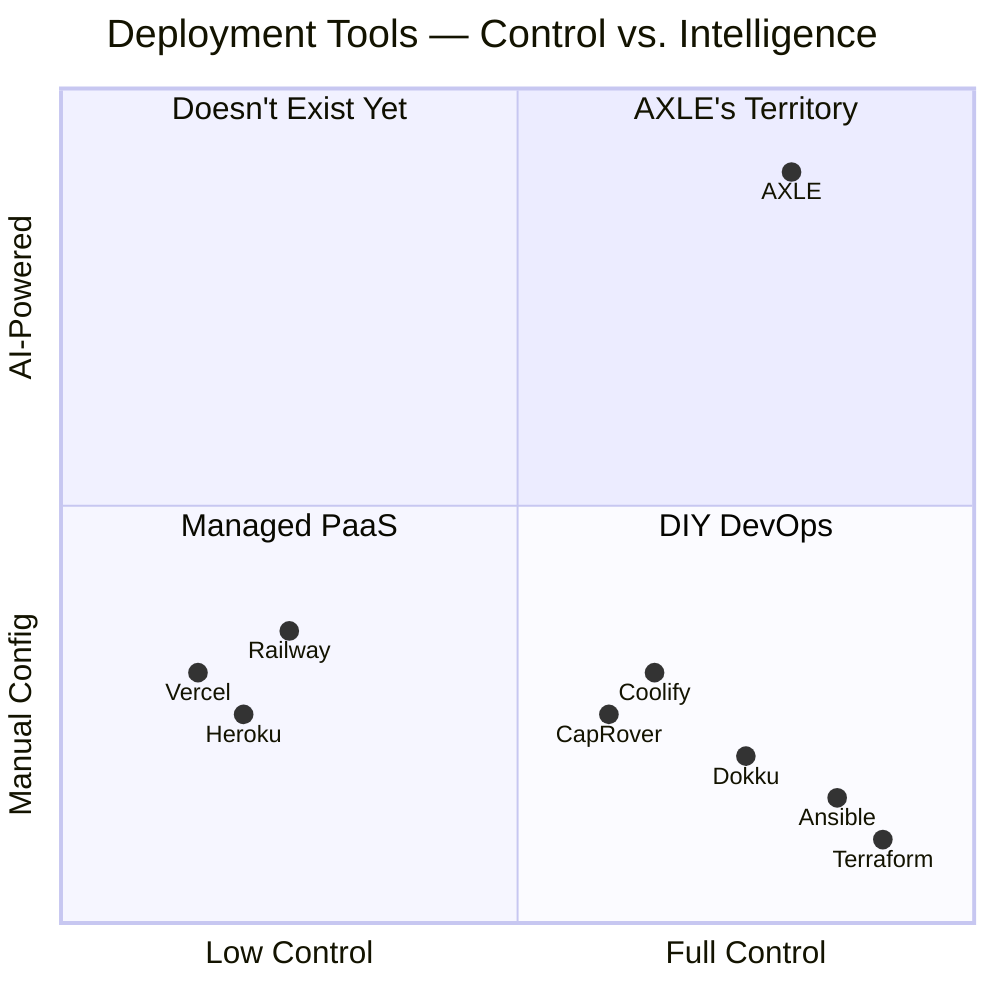

# 🔍 AXLE OS — Competitive Analysis & Market Positioning

## TL;DR — Is AXLE Unique?

**Yes and No.** There are tools in the market that solve *parts* of what AXLE does, but **nobody combines all of these into a single appliance OS**:

| What AXLE Does | Who Else Does It? | How AXLE Is Different |
|:--|:--|:--|
| Self-hosted deployment platform | Coolify, Dokku, CapRover | They all require Docker. AXLE uses **native systemd** — no containers |
| AI-powered deployment planning | Nobody (partially: AIAC) | **This is AXLE's killer feature.** No existing tool uses AI to *generate and execute* deployment plans |
| Custom appliance OS (AMI) | Proxmox, TrueNAS | They do virtualization/storage. Nobody makes a **deployment appliance** |
| Secrets vault isolated from AI | Nobody | Novel architectural decision |
| Self-healing AI monitor | Nobody (partially: Kubernetes) | Kubernetes does self-healing for containers. AXLE does it for **native processes** with AI diagnosis |
| AI chatbot with live server context | Nobody | Coolify has basic LLM integration, but not a chatbot with deployment history + live metrics |

### **The Unique Combination**
> **No product on the market today is a purpose-built Linux distribution (AMI) that combines AI-powered stack detection, automated native deployment (no Docker), an encrypted secrets vault, a real-time dashboard, and an AI self-healing monitor — all pre-installed and ready from first boot.**

That's what makes AXLE unique. It's not one feature — it's the **combination and the form factor** (appliance OS).

---

## The Competitive Landscape

### Category 1: Self-Hosted PaaS (Closest Competitors)

These are the tools developers currently use to deploy apps on their own servers:

#### 🟢 Coolify — *The Market Leader*
- **What it is**: Open-source, self-hosted PaaS with a beautiful web dashboard
- **Stars**: ~40k+ on GitHub
- **How it works**: Docker-based. You install Coolify on a VPS, connect Git repos, and it deploys containers
- **Strengths**: Modern UI, multi-server management, one-click service templates (280+), active development
- **Weaknesses**:
  - 🔴 **Docker-only** — everything runs in containers, no native systemd
  - 🔴 **No AI** — no automatic stack detection, no AI-generated deployment plans
  - 🔴 **Manual setup** — you must install Coolify on a server yourself
  - 🔴 **No self-healing AI** — basic health checks only, no AI diagnosis
  - 🔴 **High resource usage** — Docker overhead + Coolify itself consumes significant RAM
  - 🔴 **Not an OS** — it's a tool you install, not a ready-to-go appliance

#### 🟡 Dokku — *Mini-Heroku*
- **What it is**: Lightweight, CLI-driven PaaS ("Heroku on a VPS")
- **Stars**: ~28k+ on GitHub
- **How it works**: `git push dokku main` → Buildpack detection → Docker container
- **Strengths**: Extremely lightweight, stable, veteran project, plugin ecosystem
- **Weaknesses**:
  - 🔴 **Docker-only** — all apps run in containers
  - 🔴 **No AI at all** — detection is via buildpacks (predefined patterns), not intelligent
  - 🔴 **No web dashboard** — CLI only
  - 🔴 **No monitoring/self-healing** — needs external tools
  - 🔴 **Single-server only** — no multi-server support

#### 🟡 CapRover — *Easy Docker PaaS*
- **What it is**: Web-based PaaS built on Docker Swarm
- **Strengths**: Easy setup, one-click app templates, Docker Swarm clustering
- **Weaknesses**:
  - 🔴 **Docker-only**, requires Dockerfile or Captain Definition file
  - 🔴 **No AI** — template-based, not intelligent
  - 🔴 **Development slowed down** — less active than Coolify
  - 🔴 **Dated UI**

#### 🟠 Dokploy — *Vercel-Style Self-Hosted*
- **What it is**: Modern, Vercel-like open-source PaaS
- **Strengths**: Clean UI, simple setup, Docker-based
- **Weaknesses**: Newer, smaller community, Docker-only, no AI

---

### Category 2: Infrastructure Automation (Different Approach)

These tools automate server config but require deep expertise:

#### ⚪ Ansible
- **What it is**: Agentless configuration management via YAML playbooks
- **Problem**: Developers must *write* the playbooks. Steep learning curve. Not interactive. No dashboard. No AI planning.
- **AXLE advantage**: AXLE's AI *generates* what would be Ansible playbooks, automatically, from scanning the project.

#### ⚪ Terraform / OpenTofu
- **What it is**: Infrastructure as Code — provisions cloud resources
- **Problem**: Handles infrastructure *provisioning* (spin up EC2). Doesn't handle *application deployment* (configure Nginx, install deps, manage processes). AXLE handles the app layer.

---

### Category 3: Managed PaaS (Commercial Competitors)

#### 🔵 Vercel / Netlify
- **Category**: Managed frontend deployment
- **Problem**: No custom backends, no databases on their infra, vendor lock-in, expensive at scale
- **AXLE advantage**: Full backend + database + custom Nginx, on your own infrastructure, no vendor fees

#### 🔵 Railway / Render
- **Category**: Managed full-stack PaaS
- **Problem**: Per-seat and usage billing, limited server configuration, no root access
- **AXLE advantage**: Full root access, pay only for EC2, unlimited configuration

#### 🔵 Heroku
- **Category**: Original PaaS
- **Problem**: Expensive, limited free tier, no server customization, Salesforce-owned
- **AXLE advantage**: Self-hosted, free, full control

---

### Category 4: AI Infrastructure Tools (Emerging)

#### ⚪ AIAC (AI Infrastructure-as-Code)
- **What it is**: CLI tool that uses LLMs to *generate* Terraform/Ansible code
- **Problem**: Only generates code — doesn't execute it, doesn't monitor, doesn't have a dashboard. You still need to run the code yourself.
- **AXLE advantage**: AXLE generates AND executes AND monitors. End-to-end.

#### ⚪ Kuberns
- **What it is**: "AI-native" PaaS (newer entrant)
- **Problem**: Kubernetes-based — massive complexity overhead. Enterprise-focused pricing.
- **AXLE advantage**: No Kubernetes. No Docker. Native systemd. Simple and lightweight.

#### ⚪ Pulumi (with Neo AI agent)
- **What it is**: IaC platform with AI assistant
- **Problem**: Still Infrastructure-as-Code — you write code, AI helps. Not automatic.
- **AXLE advantage**: Zero-code. Paste URL → AI handles everything.

---

## 🎯 AXLE's Unique Selling Points (What Nobody Else Has)

```
┌─────────────────────────────────────────────────────────────────────┐
│                    WHAT MAKES AXLE UNIQUE                          │
├─────────────────────────────────────────────────────────────────────┤
│                                                                     │
│  1. 🧠 AI-FIRST DEPLOYMENT                                        │
│     No other tool uses AI to scan a project, understand its        │
│     stack, and generate a complete deployment plan automatically.   │
│     Coolify uses Docker. Dokku uses Buildpacks. AXLE uses AI.      │
│                                                                     │
│  2. 📦 APPLIANCE OS (Not Just a Tool)                              │
│     AXLE is a Linux DISTRIBUTION — like Proxmox for virtualization.│
│     You launch an AMI and everything is ready. Zero installation.  │
│     Nobody else ships a deployment platform as a full OS.          │
│                                                                     │
│  3. ⚙️ NATIVE SYSTEMD (No Docker)                                 │
│     Every competitor (Coolify, Dokku, CapRover) requires Docker.   │
│     AXLE runs apps natively with systemd — less overhead, simpler, │
│     better performance, and easier to debug.                       │
│                                                                     │
│  4. 🔒 AI-ISOLATED SECRETS VAULT                                  │
│     The AI engine NEVER sees secret values — only key names.       │
│     This is a hard architectural invariant. No competitor has this. │
│                                                                     │
│  5. 🩺 AI SELF-HEALING MONITOR                                    │
│     60-second health checks with AI-powered diagnosis and          │
│     auto-fix. Not just "is the process running?" but "WHY did it   │
│     crash and what should we do about it?"                         │
│                                                                     │
│  6. 💬 CONTEXTUAL AI CHATBOT                                      │
│     Ask "why is my app slow?" and get an answer based on REAL      │
│     server metrics, deployment history, and live logs — not        │
│     generic advice.                                                │
│                                                                     │
│  7. 🎯 ZERO-CONFIG PHILOSOPHY                                     │
│     Paste GitHub URL → AI does everything. No Dockerfile needed.   │
│     No docker-compose. No config files. No learning curve.         │
│                                                                     │
└─────────────────────────────────────────────────────────────────────┘
```

---

## Feature Comparison Matrix

| Feature | **AXLE OS** | **Coolify** | **Dokku** | **CapRover** | **Railway** | **Vercel** |
|:--|:--:|:--:|:--:|:--:|:--:|:--:|
| **Self-hosted** | ✅ | ✅ | ✅ | ✅ | ❌ | ❌ |
| **Free / open-source** | ✅ | ✅ | ✅ | ✅ | ❌ | ❌ |
| **Appliance OS (ready from boot)** | ✅ | ❌ | ❌ | ❌ | ❌ | ❌ |
| **AI stack detection** | ✅ | ❌ | ❌ | ❌ | ❌ | ❌ |
| **AI deployment planning** | ✅ | ❌ | ❌ | ❌ | ❌ | ❌ |
| **AI self-healing monitor** | ✅ | ❌ | ❌ | ❌ | ❌ | ❌ |
| **AI chatbot (live context)** | ✅ | ❌ | ❌ | ❌ | ❌ | ❌ |
| **No Docker required** | ✅ | ❌ | ❌ | ❌ | ❌ | ❌ |
| **Native systemd** | ✅ | ❌ | ❌ | ❌ | ❌ | ❌ |
| **Encrypted secrets vault** | ✅ | ⚠️ Basic | ⚠️ Basic | ⚠️ Basic | ⚠️ | ⚠️ |
| **Real-time dashboard** | ✅ | ✅ | ❌ | ✅ | ✅ | ✅ |
| **Custom backends** | ✅ | ✅ | ✅ | ✅ | ✅ | ❌ |
| **Full root access** | ✅ | ✅ | ✅ | ✅ | ❌ | ❌ |
| **One-click rollback** | ✅ | ✅ | ⚠️ | ⚠️ | ✅ | ✅ |
| **Multi-server** | ❌ (v2) | ✅ | ❌ | ✅ | ✅ | ✅ |
| **CI/CD webhooks** | ❌ (v2) | ✅ | ✅ | ✅ | ✅ | ✅ |

---

## 📊 Market Positioning



**AXLE sits in an unoccupied quadrant**: High control (self-hosted, root access) + High intelligence (AI-powered everything). Nobody is there yet.

---

## 🎯 Who Is AXLE For? (Target Users)

| User Persona | Pain Point | How AXLE Solves It |
|:--|:--|:--|
| **Indie developer** | "I want to deploy my side project on EC2 but don't know Nginx, systemd, or SSL" | Paste GitHub URL → done |
| **Startup founder** | "I need a production server but can't afford DevOps or Vercel at scale" | $10/month EC2 instance + AXLE = unlimited deploys |
| **Student / learner** | "AWS is confusing, deploying anything takes me hours" | Zero-config: AXLE handles everything |
| **Agency developer** | "I deploy client projects frequently and always repeat the same server setup" | Reusable AMI — launch, deploy, bill client |
| **Self-hoster** | "I run everything on my own infra and hate Docker overhead" | Native systemd, no containers |

---

## ⚠️ Honest Assessment — Where AXLE Is Weaker (Initially)

| Area | Competitor Advantage | AXLE Catch-Up Plan |
|:--|:--|:--|
| **Multi-server** | Coolify supports managing multiple servers from one dashboard | Phase 3 (v2.0) |
| **CI/CD webhooks** | Coolify, Dokku have push-to-deploy from Git | Phase 3 (v2.0) |
| **Community size** | Coolify has 40k+ stars, massive community | Build community through AI uniqueness |
| **One-click templates** | Coolify has 280+ app templates | Not AXLE's approach — AI detects automatically |
| **Docker ecosystem** | Huge ecosystem of pre-built Docker images | AXLE deploys source code, not containers |
| **Maturity** | Dokku (10+ years), Coolify (4+ years) | New project — will need time to stabilize |

---

## 💡 Strategic Recommendations

### 1. Lead with AI — It's the Differentiator
The entire marketing message should be: **"The AI handles your server configuration. You just paste your GitHub URL."**
Every competitor requires you to understand Docker, write config files, or set up build pipelines. AXLE asks: *"What's your GitHub URL?"*

### 2. Native systemd as a Feature, Not a Limitation
Frame the no-Docker approach as a **strength**:
- "30% less RAM usage than Docker-based platforms"
- "Debug with standard Linux tools — no container complexity"
- "systemd auto-restarts, exactly like how your EC2 was designed to work"

### 3. The Appliance OS Angle is Novel
No deployment tool ships as a ready-to-go AMI/ISO. This is similar to how Proxmox differentiated from manually installing KVM — AXLE differentiates from manually installing deployment tools.

### 4. Open Source is Non-Negotiable
All successful competitors are open source. AXLE must be too.

### 5. Target Indie Hackers and Students First
The larger developer communities (indie hackers, r/selfhosted, Hacker News) are the early adopters for tools like this. They value:
- Free/open-source
- Self-hosted
- Novel AI capabilities
- Simple experience
